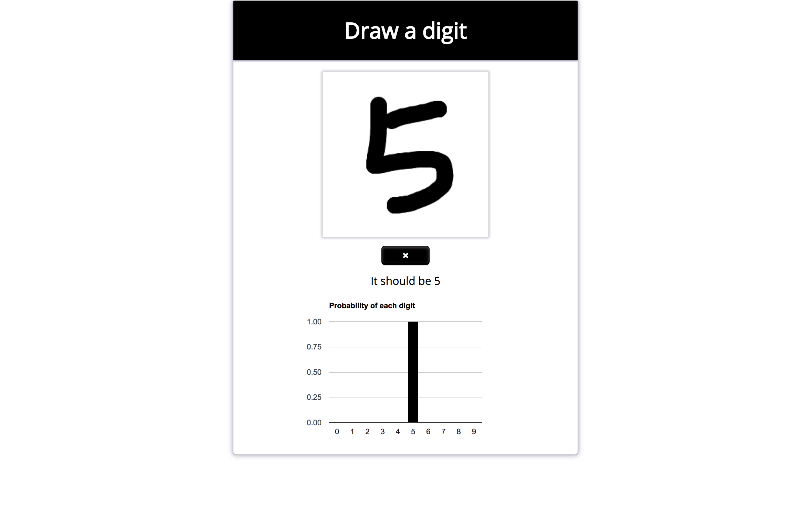

Digit classifier
=========
 

Predict handwritten digits using Keras model.

## Demo

A working live demo [https://dtk0528.github.io/digit-classifier](https://dtk0528.github.io/digit-classifier)

---

## Setup

#### Get the source code  

	git clone https://github.com/dtk0528/digit-classifier.git
	cd digit-classifier
	
#### Download and install all the dependencies

	yarn install
  
---
	
## Usage

#### Start the server (in server/)

	yarn start

#### Open a browser and go to

	localhost:3001

---

## Built With

* [Keras.js](https://github.com/transcranial/keras-js) - Run Keras models (tensorflow backend) in the browser, with GPU support
* [Express](http://expressjs.com/) - Web framwork for Node.js.

---

## License

This project is under the MIT license. You are free to do whatever you want with it.
